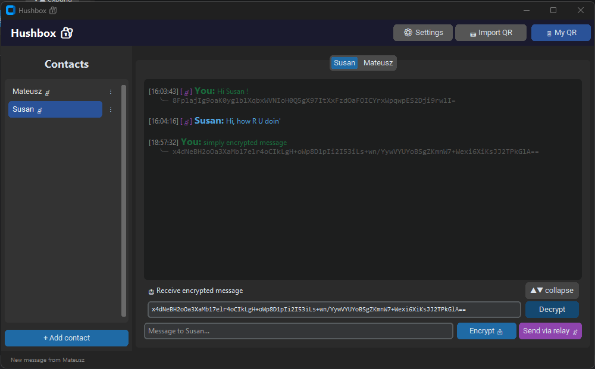
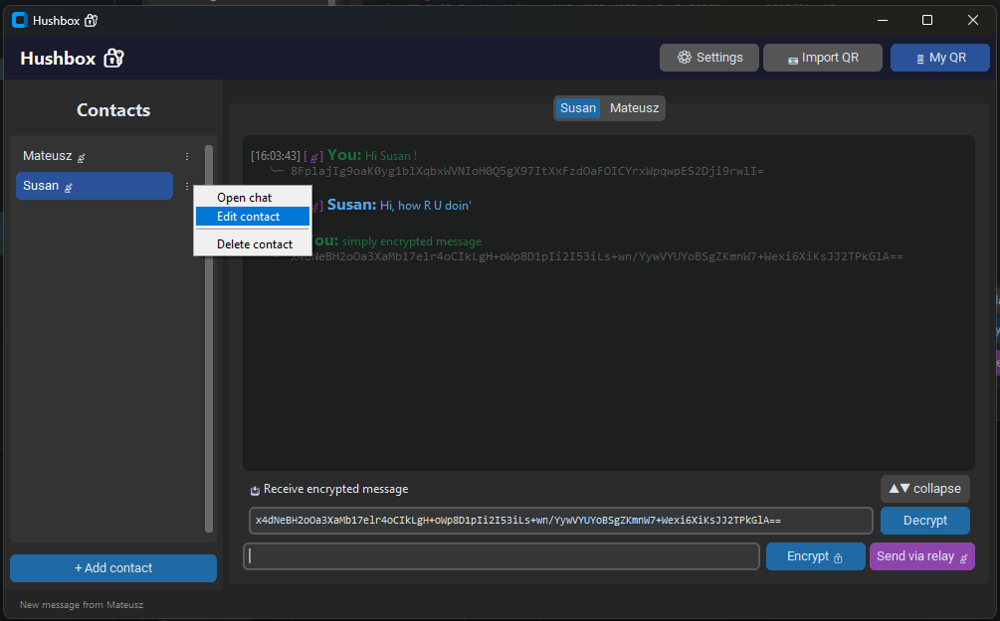

# Hushbox 🔐

End-to-end encrypted messaging using NaCl/Curve25519. No accounts — just keys. Relay is blind to content.

## Screenshots





## Structure

```
hushbox/
├── packages/
│   └── hushbox-core/                   # E2E crypto core — MIT
│       ├── hushbox_core/
│       │   ├── encryption_manager.py   # NaCl keypairs, encrypt/decrypt
│       │   ├── chat_store.py           # Message history (JSON)
│       │   ├── relay_transport.py      # HTTP relay client (long polling)
│       │   └── app_settings.py         # Persistent settings
│       └── tests/
│
├── services/
│   └── hushbox-relay-api/              # Store-and-forward relay server — MIT
│       ├── hushbox_relay_api/
│       │   └── server.py               # Flask + MongoDB
│       ├── Dockerfile
│       └── docker-compose.yml
│
├── clients/
│     ├── hushbox-web/                  # Desktop GUI (customtkinter) — MIT
│     │   └── main.py
│     └── hushbox-mobile/               # Mobile client — planned
│         ├── README.md
│         └── ROADMAP.md
│         
└── docs/
    └── images/                         # UI screenshots

```

## Architecture

```
┌─────────────────┐     ┌─────────────────┐
│  hushbox-web    │     │  hushbox-mobile  │
│  (customtkinter)│     │  (Kivy / native) │
└────────┬────────┘     └────────┬─────────┘
         │                       │
         └───────────┬───────────┘
                     │  uses
              ┌──────▼──────┐
              │ hushbox-core │   MIT — public API, auditable
              │  (Python pkg)│
              └──────┬───────┘
                     │  HTTP (long polling)
              ┌──────▼───────────────┐
              │  hushbox-relay-api   │   your own Docker
              │  Flask + MongoDB     │
              └──────────────────────┘
```

## Quick Start

### 1. Start relay server

```bash
cd services/hushbox-relay-api
docker compose up -d
```

### 2. Run desktop client

```bash
cd clients/hushbox-web
pip install -r requirements.txt
python main.py
```

Then: **⚙ Settings** → enter relay URL (e.g. `https://relay.domain.com:5001`) → Save.

## Packages

| Package | Description | License |
|---------|-------------|---------|
| `hushbox-core` | Crypto, storage, transport | MIT |
| `hushbox-relay-api` | Relay server | MIT |
| `hushbox-web` | Desktop client | MIT |
| `hushbox-mobile` | Mobile client (planned; design-only for now) | TBD |

## Security Model

- **NaCl Box** (X25519 + XSalsa20-Poly1305) — authenticated E2E encryption
- Private key never leaves the device (`my_private_key.bin` / Keychain)
- Relay server sees only: SHA-256 key hashes + encrypted blobs
- No accounts, no phone numbers, no telemetry

## Development

```bash
# Install core in editable mode
pip install -e packages/hushbox-core

# Run all tests
pytest packages/hushbox-core/tests/ -v
pytest services/hushbox-relay-api/tests/ -v
```

## License

All packages in this repository are licensed under the **MIT License** unless noted otherwise.
See individual `LICENSE` files in each package/service directory.
